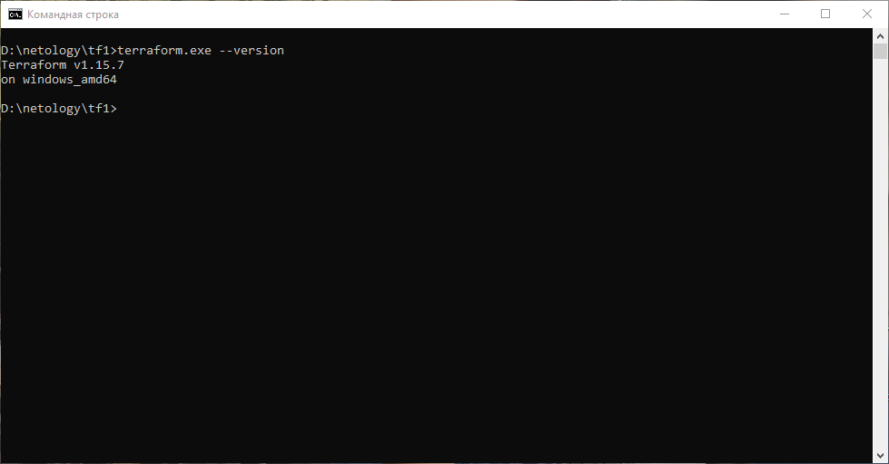
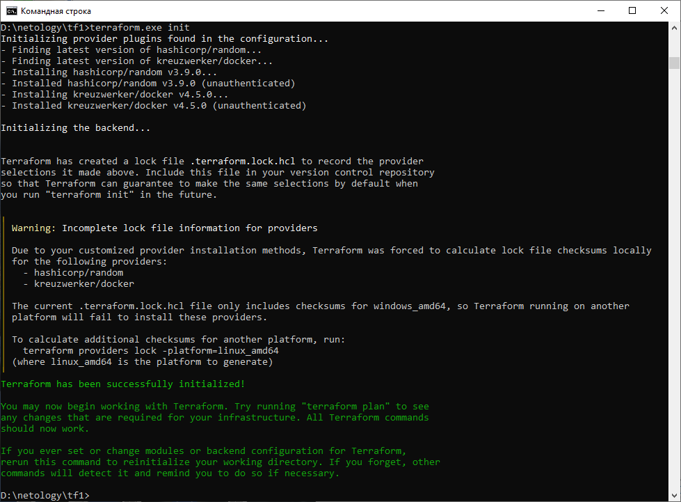
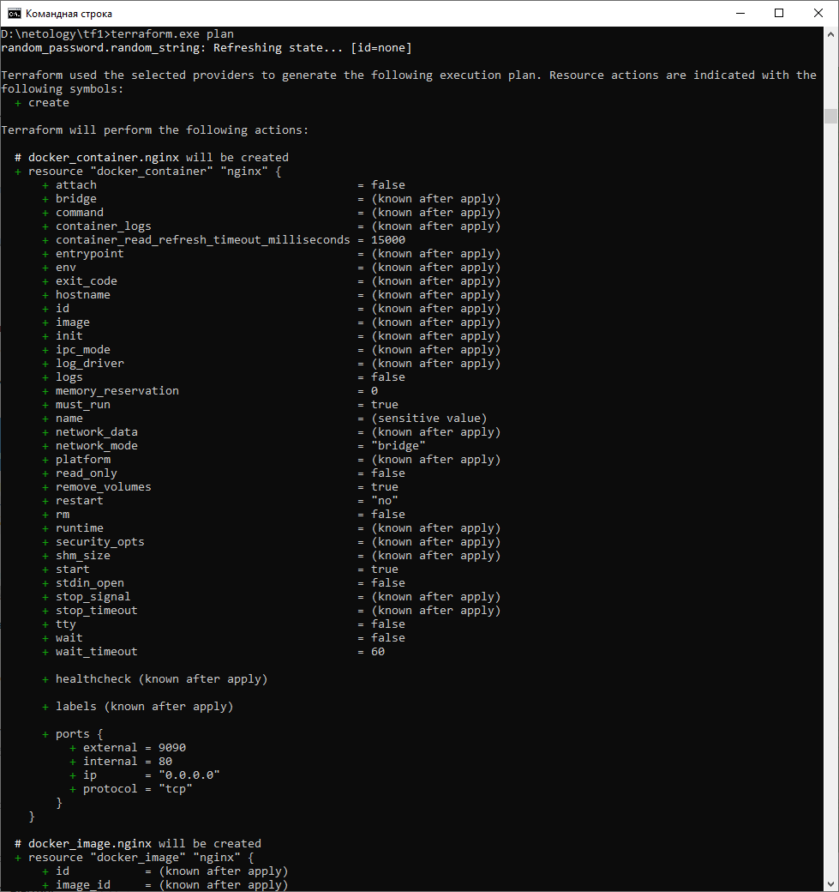
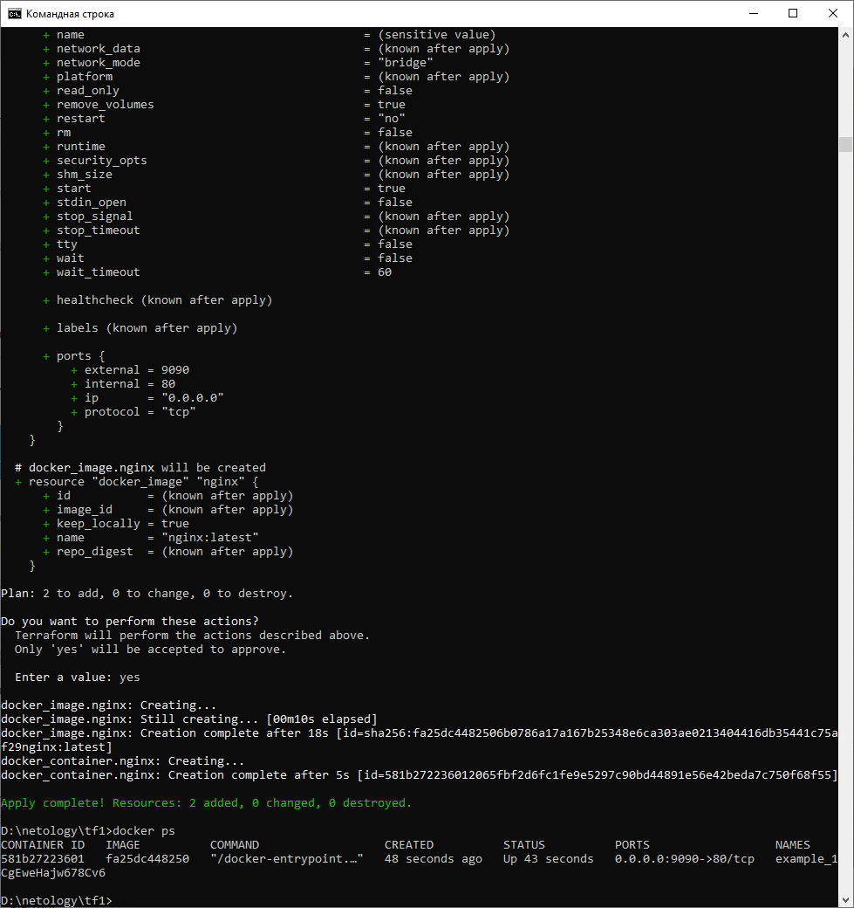
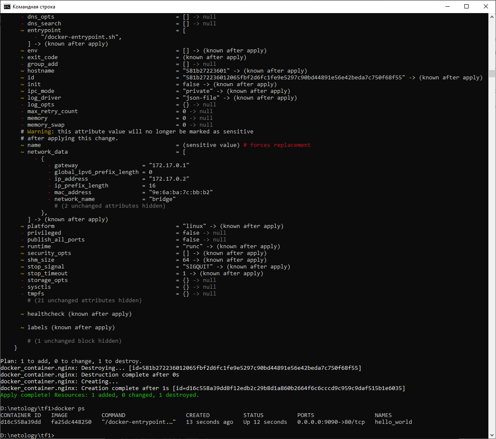
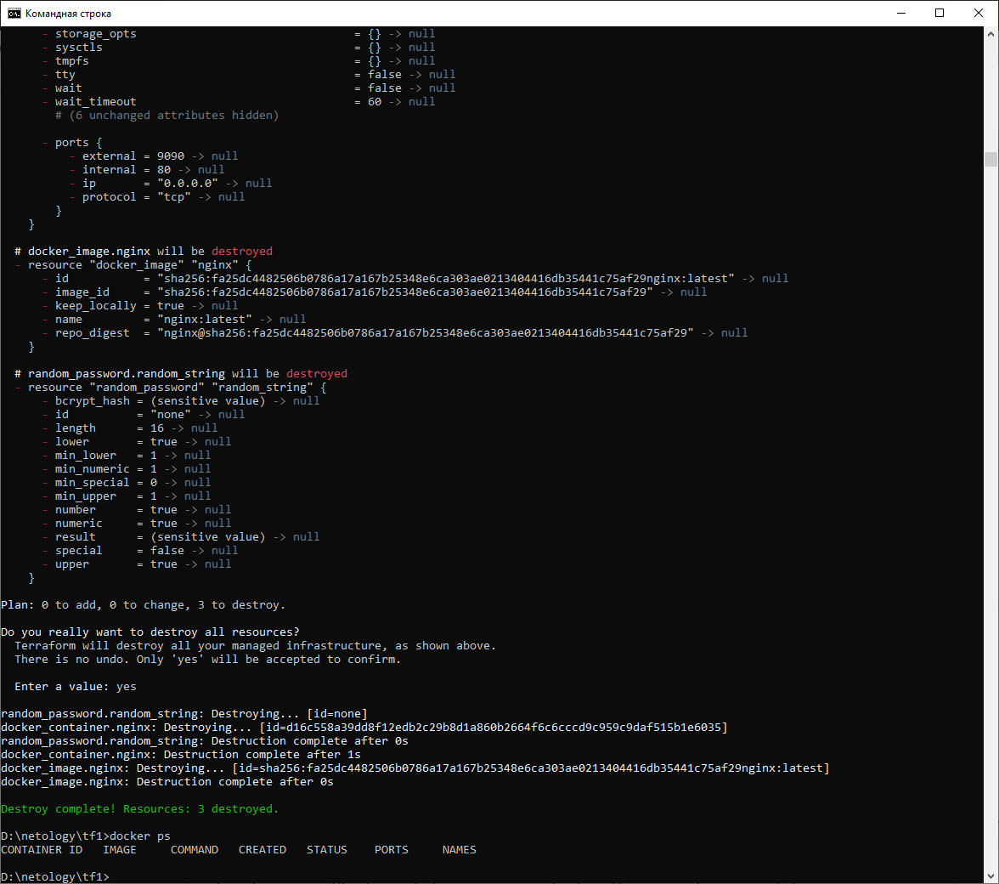
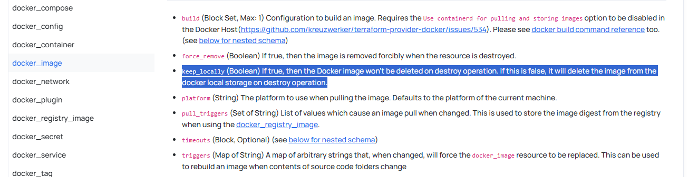

# Домашнее задание к занятию «Введение в Terraform» Сафронов П.А.

### Цели задания

1. Установить и настроить Terrafrom.
2. Научиться использовать готовый код.

------

### Чек-лист готовности к домашнему заданию

1. Скачайте и установите **Terraform** версии >=1.12.0 . Приложите скриншот вывода команды ```terraform --version```.

2. Скачайте на свой ПК этот git-репозиторий. Исходный код для выполнения задания расположен в директории **01/src**.
3. Убедитесь, что в вашей ОС установлен docker.

------

### Инструменты и дополнительные материалы, которые пригодятся для выполнения задания

1. Репозиторий с ссылкой на зеркало для установки и настройки Terraform: [ссылка](https://github.com/netology-code/devops-materials).
2. Установка docker: [ссылка](https://docs.docker.com/engine/install/ubuntu/). 
------
### Внимание!! Обязательно предоставляем на проверку получившийся код в виде ссылки на ваш github-репозиторий!
------

### Задание 1

1. Перейдите в каталог [**src**](https://github.com/netology-code/ter-homeworks/tree/main/01/src). Скачайте все необходимые зависимости, использованные в проекте. 

2. Изучите файл **.gitignore**. В каком terraform-файле, согласно этому .gitignore, допустимо сохранить личную, секретную информацию?(логины,пароли,ключи,токены итд)
```
personal.auto.tfvars
```
3. Выполните код проекта. Найдите  в state-файле секретное содержимое созданного ресурса **random_password**, пришлите в качестве ответа конкретный ключ и его значение.
```
"result": "1CgEweHajw678Cv6"
```
4. Раскомментируйте блок кода, примерно расположенный на строчках 29–42 файла **main.tf**.
Выполните команду ```terraform validate```. Объясните, в чём заключаются намеренно допущенные ошибки. Исправьте их.
```
D:\netology\tf1>terraform.exe validate
╷
│ Error: Missing name for resource
│
│   on main.tf line 21, in resource "docker_image":
│   21: resource "docker_image" {
│
│ All resource blocks must have 2 labels (type, name).
|    === Для ресурса указан 1 лейбл, а должно быть обязательно два
|
│ Error: Invalid resource name
│
│   on main.tf line 26, in resource "docker_container" "1nginx":
│   26: resource "docker_container" "1nginx" {
│
│ A name must start with a letter or underscore and may contain only letters, digits, underscores, and dashes.
|    === Начало имени должно начинаться с буквы или нижнего подчеркивания.
|
│ Error: Reference to undeclared resource
│
│   on main.tf line 28, in resource "docker_container" "nginx":
│   28:   name  = "example_${random_password.random_string_FAKE.resulT}"
│
│ A managed resource "random_password" "random_string_FAKE" has not been declared in the root module.
|    === Ресурс "random_password" "random_string_FAKE" не описан в корневом модуле, необходимо сверить имена со строкой 13.
|        файла main.tf
```
5. Выполните код. В качестве ответа приложите: исправленный фрагмент кода и вывод команды ```docker ps```.





7. Замените имя docker-контейнера в блоке кода на ```hello_world```. Не перепутайте имя контейнера и имя образа. Мы всё ещё продолжаем использовать name = "nginx:latest". Выполните команду ```terraform apply -auto-approve```.
Объясните своими словами, в чём может быть опасность применения ключа  ```-auto-approve```. Догадайтесь или нагуглите зачем может пригодиться данный ключ? В качестве ответа дополнительно приложите вывод команды ```docker ps```.
```
auto-approve автоматически подтверждает все правки в конфигурации и публикует конфиг со всеми исправлениями и ошибками
естесственно последствия таких действий весьма разнообразны
```


8. Уничтожьте созданные ресурсы с помощью **terraform**. Убедитесь, что все ресурсы удалены. Приложите содержимое файла **terraform.tfstate**. 


```
{
  "version": 4,
  "terraform_version": "1.15.7",
  "serial": 11,
  "lineage": "9047f83d-bbf9-26d3-eb59-03c32364b45e",
  "outputs": {},
  "resources": [],
  "check_results": null
}
```

9. Объясните, почему при этом не был удалён docker-образ **nginx:latest**. Ответ **ОБЯЗАТЕЛЬНО НАЙДИТЕ В ПРЕДОСТАВЛЕННОМ КОДЕ**, а затем **ОБЯЗАТЕЛЬНО ПОДКРЕПИТЕ** строчкой из документации [**terraform провайдера docker**](https://library.tf/providers/kreuzwerker/docker/latest).  (ищите в классификаторе resource docker_image )

```
Образ не был удален, т.к. в файле main.tf мы прописали, что хотим его сохранять:

resource "docker_image" "nginx" {
  name         = "nginx:latest"
  keep_locally = true
}

```

